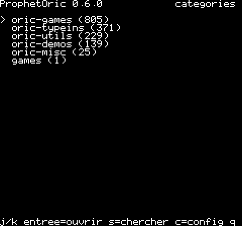

# ProphetOric — client Prophet pour Oric (LOCI + modem Wi‑Fi)

 

Client du dépôt de programmes **Prophet** (`prophet.3617.fr`, serveur
[Neo6502Prophet](../Neo6502Prophet)) pour **Oric 1 / Atmos** équipé du
**LOCI** (cartouche RP2040 de sodiumlb) et du modem **PicoWiFiModemUSB** :
catalogue Oric (zone réservée, mot de passe), fiche, téléchargement du
`.tap`/`.dsk` sur le stockage du LOCI, lancement.

**État : sprint 5** (`build/prophet.tap`, ~18 Ko) : catégories / recherche →
liste paginée → fiche → `g` télécharge sur le LOCI (tranches Range de 32 Ko, reprise sur coupure) → `l` monte la cassette
(`CLOAD""`) ou démarre la disquette (`MIA_BOOT`) ; `PROPHET.CFG` et écran de
configuration (`c` : hôte, HTTP/TLS, port, explorateur volumes → dossiers, mot de passe) ; ACIA à **9600 bauds**, vérifié avec l'anneau de 32 octets
du firmware LOCI ; via le modem PicoWiFi émulé de Phosphoric (vraies sockets). Validation **en émulation uniquement**
(Phosphoric, `~/Oric1`) : le PO n'a pas le matériel.

```
make            # build/prophet.tap (prophet.3617.fr:8998)
make run        # Phosphoric SDL + LOCI (flash = ./flash/, avec microdis.rom) + modem PicoWiFi émulé → prophet.3617.fr
make test       # tests hôte (cli, http sur faux modem) + 9 scénarios Phosphoric headless → prophetd local (ONLY=nom ; LONG=1 : disquette 1 Mo, 18 min)
```
Touches : j/k (flèches) choisir, entrée ouvrir, b retour, n/p page, s chercher, g télécharger (fiche), l lancer (cassette montée + CLOAD"" / disquette + MIA_BOOT), c configuration, q quitter.

| | |
|---|---|
| Transport | ACIA 6551 à `$0380` (LOCI) → modem Hayes PicoWiFiModemUSB (`ATD-hôte:port` : `-` = sans telnet, sinon CR→CR NUL ; `ATD-#hôte:443` = TLS terminé par le modem, firmware ≥ 0.2.0, **non vérifié sur matériel**) → HTTP/1.1 `GET` |
| Stockage | API MIA du LOCI (`$03AF` : OPEN/WRITE/READDIR…), clé USB / SD / flash |
| Protocole | `cli` de Prophet (`ResponseFormat: cli`), `?platform=oric`, `X-Prophet-Password`, `Range` |
| Chaîne | cc65 (`-t atmos`, comme OricTel) ; tests hôte gcc + Phosphoric headless |
| Réutilisé | OricTel (`~/orictel`) : driver ACIA `serial_asm.s`, file d'émission, `at_modem.c` |

Voir **`docs/MANUEL.md`** (manuel utilisateur, captures, vidéo `docs/img/demo.mp4`),
`docs/CADRAGE.md` (architecture, risques, plan de tests), `ROADMAP.md`,
`CONTRIBUTING.md`. Licence : EUPL‑1.2 (`LICENSE`). Auteur : bmarty.

Dépôts : https://framagit.org/benedictemarty/prophetoric ·
https://github.com/benedictemarty/ProphetOric
