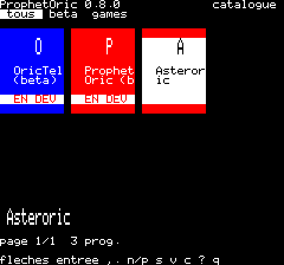
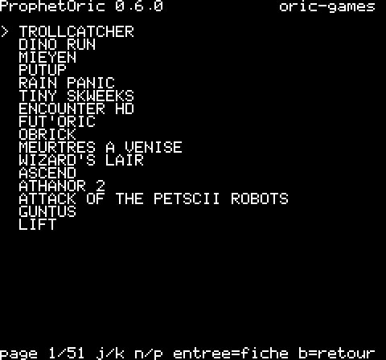
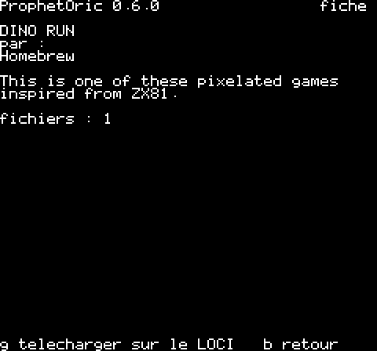
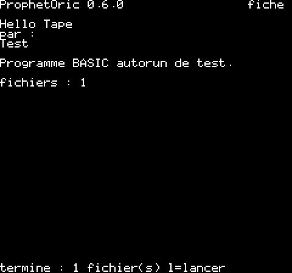
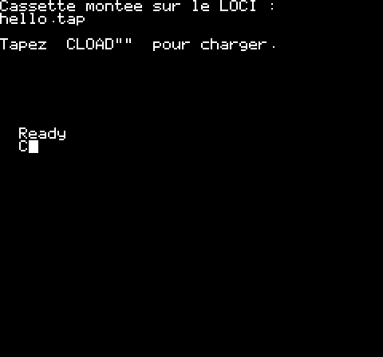
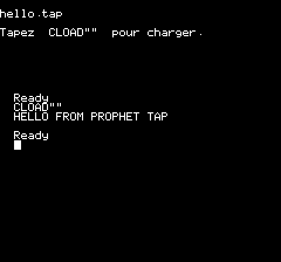
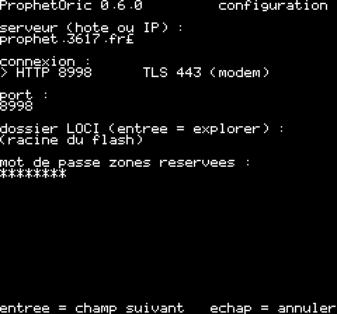
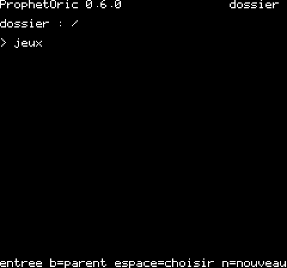

# ProphetOric — manuel utilisateur

ProphetOric est un client pour **Oric 1 / Atmos** du dépôt de programmes
**Prophet** (`prophet.3617.fr`). Depuis l'Oric, vous parcourez le catalogue,
lisez la fiche d'un programme, le téléchargez sur le stockage du LOCI et le
lancez — cassette (`.tap`) ou disquette (`.dsk`).

Vidéo de démonstration (2 min, catalogue → fiche → téléchargement → lancement) :
[`img/demo.mp4`](img/demo.mp4).

## 1. Ce qu'il faut

| Élément | Rôle |
|---|---|
| Oric 1 ou Atmos (ROM BASIC 1.1 conseillée) | la machine |
| **LOCI** (cartouche de sodiumlb) | stockage (flash interne `0:`, clés USB `1:`‑`4:`, carte SD) et port modem |
| **PicoWiFiModemUSB** branché sur le LOCI | modem Wi‑Fi Hayes (ACIA 6551 en `$0380`) |
| Un réseau Wi‑Fi déjà configuré dans le modem | ProphetOric ne configure pas le Wi‑Fi (utilisez OricTel ou `AT$SSID`/`AT$PASS`) |

Sans matériel, tout fonctionne dans l'émulateur **Phosphoric** (voir §7).

> ProphetOric a été validé **en émulation uniquement**. Sur un LOCI réel, le
> débit (9600 bauds) et la lecture des fichiers sont à confirmer.

## 2. Installation

1. Copiez `prophet.tap` sur le stockage du LOCI (clé USB ou flash), et, pour
   l'anglais ou l'espagnol, `EN.LNG` / `ES.LNG` à côté (§6).
2. Dans le menu du LOCI, montez `prophet.tap` comme cassette, puis en BASIC :
   `CLOAD""` — le programme démarre seul.
3. Au premier lancement, ProphetOric contacte `prophet.3617.fr:8998` et
   affiche les catégories. Si le modem ne répond pas, un message l'indique
   en bas de l'écran (voir §8).

## 3. L'écran

Texte 40 × 28. Ligne du haut : version et nom de l'écran ; ligne du bas :
touches disponibles ou message d'état.

| Touche | Action |
|---|---|
| flèches (ou `h` `j` `k` `l`) | choisir une carte (gauche, bas, haut, droite) ; aux bords, page voisine |
| `,` / `.` (ou `[` / `]`) | onglet (catégorie) précédent / suivant |
| `entrée` (ou `espace`) | ouvrir la fiche / valider un champ |
| `b` | retour (fiche, recherche) |
| `n` / `p` | page suivante / précédente |
| `v` | grille de cartes ↔ liste compacte |
| `s` | rechercher un programme (titre, auteur, description) |
| `g` | télécharger le programme affiché (fiche) |
| `l` | lancer le programme téléchargé |
| `c` | configuration |
| `?` (ou `/`) | aide (rappel des touches) |
| `échap` | annuler une saisie |
| `q` | quitter (retour au BASIC) |

Conseil : attendez que « connexion… » ait disparu avant d'appuyer sur une
touche — l'Oric ne garde qu'une touche en attente pendant une requête.

## 4. Parcourir le catalogue



L'écran principal montre, en haut, les **onglets** : « tous », puis les
catégories de la plateforme Oric (`oric-games`, `oric-typeins` — listings de
livres et magazines —, `oric-utils`, `oric-demos`, `oric-misc`, `games`, et
`beta` pour `en-developpement`). `,` et `.` passent d'un onglet à l'autre ; s'il
y en a trop pour la ligne, `<` et `>` signalent les onglets cachés. Les
catégories `oric-*` ne sont visibles qu'avec le mot de passe de la zone
réservée (§6).

Dessous, une **grille de 8 cartes** (les plus récents d'abord) : chaque carte a
sa couleur, l'initiale du titre en grand et le titre. La carte choisie est
blanche, bordée de sa couleur ; son titre complet s'affiche en grand sous la
grille, avec « page a/b » et le nombre de programmes. Les programmes de la
catégorie `en-developpement` (versions de travail) portent un bandeau
**EN DEV**.



`v` bascule vers une **liste compacte** de 16 titres par page (« [dev] »
marque les versions de travail), pratique dans les grandes catégories ; `v`
revient à la grille. `s` ouvre une recherche : tapez un mot (sans espace),
entrée — le résultat se parcourt comme un onglet, `b` revient aux onglets.



La fiche donne le titre, l'auteur, la description (repliée à 40 colonnes)
et la liste des fichiers ; un bandeau rouge « EN DEVELOPPEMENT » signale une
version de travail. Si l'auteur a déclaré des **composants
minimums** (ex. `loci>=0.3.1`, `picowifi`), la fiche affiche « ! peut ne pas
fonctionner sans : … » — simple avertissement, rien n'est vérifié sur votre
Oric. Si le programme est **déjà téléchargé et identique** à celui du
serveur, la fiche l'indique (« deja telecharge (identique) ») : `l` le lance
directement, `g` le retélécharge.

## 5. Télécharger et lancer

Sur la fiche, `g` télécharge tous les fichiers du programme dans le dossier
configuré (§6). En bas : « fichier i/n », une barre de progression (mise à
jour entre deux tranches de 32 Ko) et, pendant la réception, une roue
`-\|/` et le compteur de Ko. Le transfert reprend seul en cas de coupure.
Chaque fichier est ensuite **relu sur le LOCI et vérifié par CRC‑32**
(empreinte publiée par le serveur) : « OK : empreintes CRC-32 verifiees ».
Un marqueur est alors écrit dans le sous-dossier caché `.prophet/` du
dossier (il sert au « déjà téléchargé »). Les fichiers `.zip` sont ignorés
(inutilisables sur Oric).



Quand « termine : n fichier(s) l=lancer » s'affiche :

- **cassette** (`.tap`) : `l` monte la cassette sur le LOCI et rend la main
  au BASIC ; tapez `CLOAD""` — le programme se charge (et démarre s'il est
  autorun).

 

- **disquette** (`.dsk`) : `l` monte la disquette en lecteur A et
  redémarre l'Oric avec la ROM Microdisc : la disquette démarre (Sedoric…).
  Le flash du LOCI doit contenir `microdis.rom` (c'est le cas d'origine).

Un programme téléchargé reste sur le stockage : vous pouvez le relancer plus
tard depuis le menu du LOCI sans repasser par ProphetOric.

## 6. Configuration (`c`)



Six champs, `entrée` passe au suivant, `échap` annule tout :

1. **serveur** : hôte ou adresse IP (`prophet.3617.fr`).
2. **connexion** : `HTTP 8998` ou `TLS 443 (modem)` — espace ou `j`/`k`
   pour basculer. En TLS, c'est le modem PicoWiFi qui chiffre (firmware
   ≥ 0.2.0) ; le mot de passe ne circule alors plus en clair.
3. **port** : pré‑rempli d'après le type, modifiable.
4. **dossier de sauvegarde** : l'explorateur du LOCI s'ouvre.

   

   S'il y a plusieurs volumes (flash `0:`, clés USB `1:`‑`4:`), choisissez
   d'abord le volume ; puis `entrée` entre dans un sous‑dossier, `b` remonte,
   `n` crée un dossier, **espace choisit le dossier affiché**.
5. **mot de passe** de la zone réservée : sans lui, seuls les programmes
   publics sont visibles ; avec lui, tout le catalogue Oric apparaît.
   (Demandez‑le à l'administrateur du serveur.)
6. **langue** : `fr`, `en` ou `es` — espace pour changer, `entrée` pour
   valider. Le français est intégré au programme ; l'anglais et l'espagnol
   sont lus dans `EN.LNG` / `ES.LNG` (fournis avec `prophet.tap` dans le
   paquet Prophet), cherchés à côté de `PROPHET.CFG` puis dans le dossier de
   téléchargement. Fichier absent, ou d'une autre version de ProphetOric :
   « fichier de langue absent : francais » et l'interface reste en français.
   Les écrans « materiel absent » / « LOCI absent », affichés avant la
   lecture de la configuration, sont toujours en français.

La configuration est enregistrée dans `PROPHET.CFG` à la racine du volume de
démarrage du LOCI (cinq lignes : serveur, port, dossier, mot de passe,
langue ; un fichier de quatre lignes des versions précédentes reste valable)
et relue à chaque lancement. Le fichier peut aussi être écrit depuis un PC.

## 7. Sans matériel : Phosphoric

Phosphoric émule l'Oric, le LOCI et le modem PicoWiFi (vraies connexions
réseau) :

```
cd ProphetOric && make run
```
Le flash du LOCI émulé est le dossier `flash/` (`PROPHET.CFG`, fichiers
téléchargés, `microdis.rom`). À la main :
```
oric1-emu -r roms/basic11b.rom -t build/prophet.tap -f \
  --loci --loci-usb none --loci-flash flash --serial picowifi:MonReseau --serial-buffer 32
```
Ajoutez `--loci-usb DOSSIER` pour simuler une clé USB (l'explorateur montre
alors les volumes).

## 8. Messages et dépannage

| Message (bas de l'écran) | Cause probable | Que faire |
|---|---|---|
| écran « materiel absent » (Aucune interface serie…) | pas de LOCI ni de modem (Oric nu, émulateur lancé sans LOCI) | brancher le LOCI + PicoWiFi, redémarrer ; sans matériel : page « Jouer » de ProphetOric sur prophet.3617.fr (LOCI et modem émulés) ou Phosphoric `--loci --serial picowifi` |
| écran « LOCI absent » | interface série trouvée mais pas l'API du LOCI | le catalogue reste consultable ; télécharger demande le LOCI |
| `EMPREINTE DIFFERENTE (garde)` | le fichier reçu ne correspond pas à celui du serveur (transmission altérée) | relancer `g` ; le fichier fautif reste sur le stockage |
| `OK (serveur sans empreintes : non verifie)` | serveur Prophet ancien (sans `/crc32`) | rien : seule la taille a été contrôlée |
| `pas de modem (ATZ)` | le modem ne répond pas | vérifier le PicoWiFi (LED), `AT` dans OricTel |
| `connexion refusee (ATD)` | Wi‑Fi non associé, serveur/port faux | vérifier le Wi‑Fi du modem, la configuration |
| `pas de reponse` | serveur muet | réessayer ; vérifier hôte/port |
| `introuvable 404` | programme retiré, ou zone réservée sans mot de passe | mot de passe (§6) |
| `trop d'essais 429` | mot de passe faux répété (10 essais / 10 min) | attendre 10 min |
| `fichier refuse par le LOCI (dossier ?)` | dossier cible absent ou volume non monté | choisir un dossier existant (`c`), ou `n` pour le créer |
| `fichier incomplet` | coupure persistante (plus de 3 essais par tranche) | relancer `g` (le fichier repart de zéro) |
| `montage cassette/disquette impossible` | fichier absent ou LOCI occupé | vérifier le fichier sur le stockage |

## 9. Limites connues

- Vérification par CRC‑32 (détecte les erreurs de transmission ; ce n'est
  pas une signature). Pas de SHA‑256 : trop lent sur 6502.
- Les fichiers `.zip` du catalogue ne sont pas récupérés.
- 9600 bauds : environ 1 Ko/s ; une disquette de 1 Mo demande ~18 minutes.
- Un seul mot de passe (zone réservée), pas de comptes.
